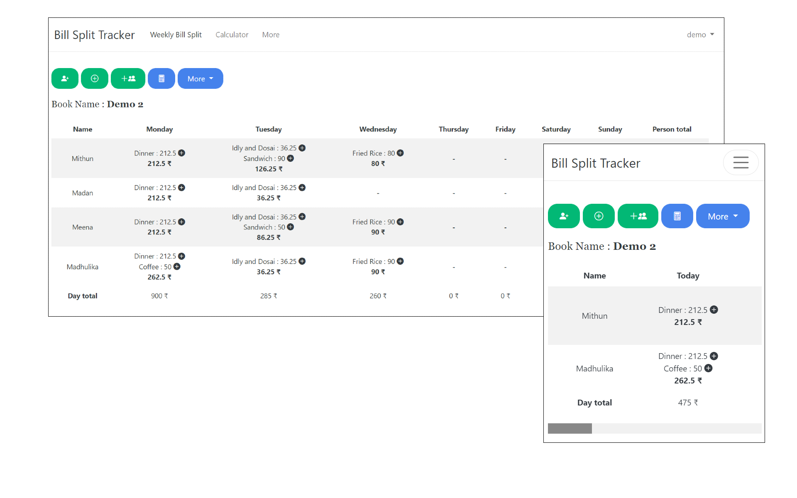
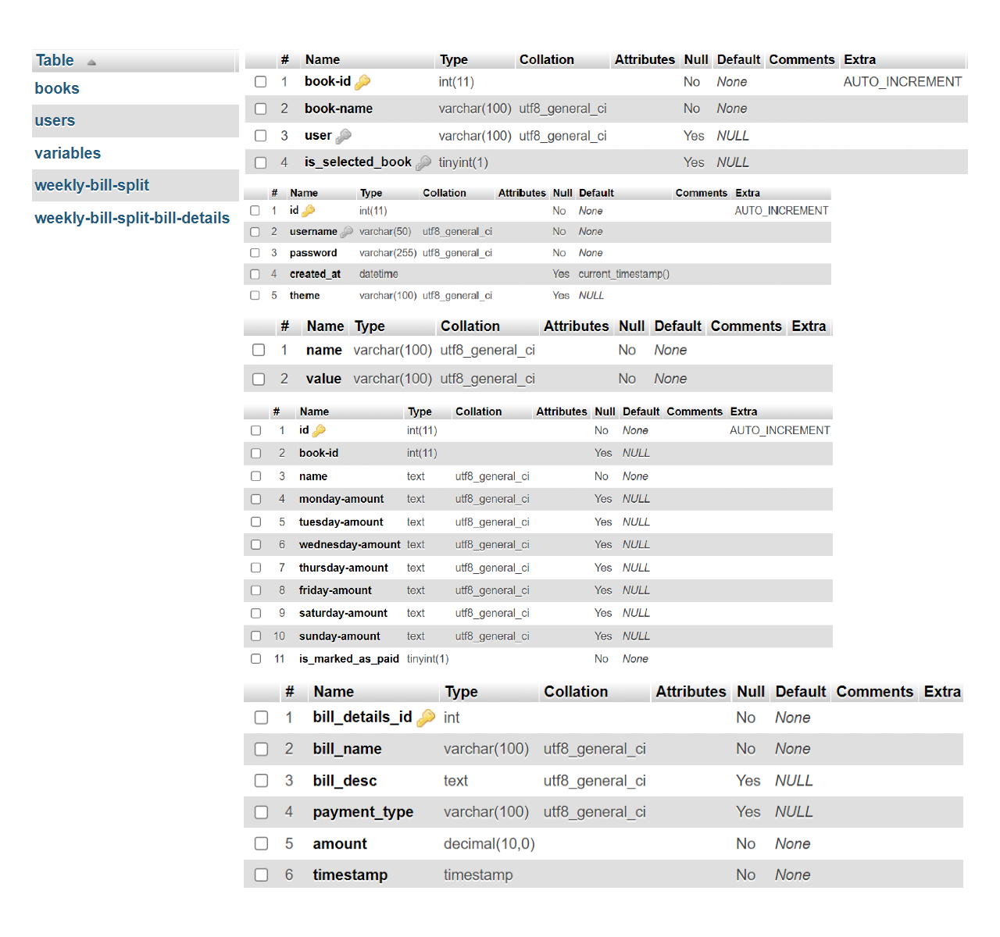

Link to App -> [http://bill-split-tracker.infinityfreeapp.com](http://bill-split-tracker.infinityfreeapp.com/home)

# Weekly Bill Split

For a group of Friends or Roommates, where one person spends for all people in the house (Food, Snacks, Grocery) and later splits the amount among them at Weekend. This tool can be helpful for the person who is spending, to keep track on the expenses spent Daily.

### How it works ?

* Each person can have a separate User Account. He **Logins**, creates a new **Book** and **Adds Person** into the Book. After a spend, he can **Split** the expense among the people added before. He can either add split to a **Single Person or Multiple Persons**,** Split Equally to All** or can **Split Individually**.
* He can then later edit (Modify/Delete) the entries using Edit Mode.
* He can switch to an another book or create new one under More dropdown.
* He can Mark as Paid for the persons after they paid the amount.
* All these data are saved in Database.
* There are Fields like Bill Name, Description, Payment Mode to keep a better track on the Bill. The same can be viewed by clicking the Plus icon next to each Split.

### Features

* Login/Registration
* Creating a New Book
* Switching to Existing Book
* Adding a Person to the Book
* Adding a Split to Single Person
* Adding Splits to Multiple Persons
* Splitting the Bill Equally among everyone in the Book
* Delete a Person
* Modify a Record
* Modify a Person Name
* Mark as Paid
* Calculator within the App

---

# Table Structure

---
